#  UNICOPEDIA PLUS

**Unicopedia Plus** is a developer-oriented set of Unicode, Unihan & emoji utilities wrapped into one single app, built with [Electron](https://www.electronjs.org/).

This desktop application works on macOS, Linux and Windows operating systems.

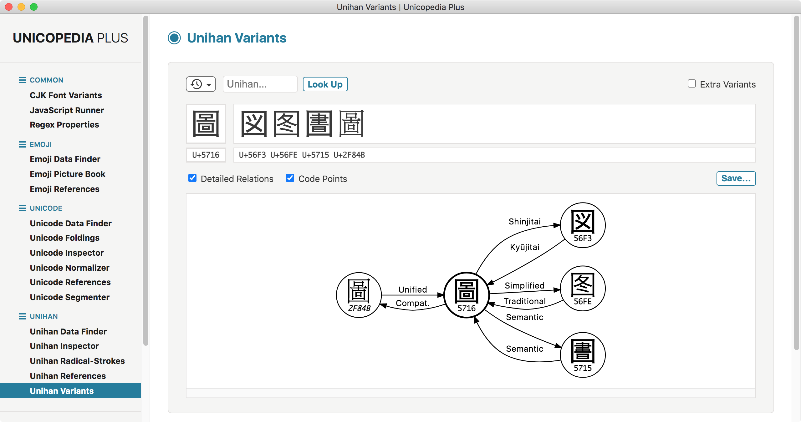

## Utilities

The following utilities are currently available:

- **CJK Font Variants**
- **JavaScript Runner**
- **Regex Properties**
- **Emoji Data Finder**
    - **Find by Name**
    - **Match Sequence**
    - **Filter Text**
- **Emoji Picture Book**
- **Emoji References**
- **Unicode Data Finder**
    - **Find by Name**
    - **Match Character**
    - **List by Block**
- **Unicode Foldings**
- **Unicode Inspector**
- **Unicode Normalizer**
- **Unicode References**
- **Unicode Segmenter**
- **Unihan Data Finder**
    - **Find by Tag Value**
    - **Match Character**
    - **View by Grid**
- **Unihan Inspector**
- **Unihan Radical-Strokes**
- **Unihan References**
- **Unihan Variants**

## CJK Font Variants

- The **CJK Font Variants** utility displays simultaneously any string of CJK (Chinese/Japanese/Korean) characters in five different typefaces belonging to the open-source set of [Source Han Sans Fonts](https://github.com/adobe-fonts/source-han-sans):

| Language | Tag | Code | Typeface |
| -------- | --- | ---- | -------- |
| Japanese | ja | JP | Source Han Sans |
| Korean | ko | KR | Source Han Sans K |
| Simplified Chinese | zh-Hans | SC | Source Han Sans SC |
| Traditional Chinese (Taiwan) | zh-Hant-TW | TC | Source Han Sans TC |
| Traditional Chinese (Hong Kong) | zh-Hant-HK | HK | Source Han Sans HC |

- Additionally, it is possible to specify a set of logographic glyph variants for display by using the <kbd>East Asian Variant</kbd> drop-down menu.
- Font variants of the CJK characters can be visualized either vertically or horizontally. Use the <kbd>Writing Mode</kbd> drop-down menu to toggle between the two modes.
- Use the <kbd>Font Weight</kbd> drop-down menu to select the font weight of the CJK characters, among: `Extra Light`, `Light`, `Regular`, `Medium`, `Semi Bold`, `Bold`, `Extra Bold`, `Heavy`.
- Clicking inside any character frame displays momentarily the same glyph for all language flavors, while alt-clicking (or shift-clicking) applies to all characters of the string in a given language flavor. This is especially useful to quickly spot the differences between glyph variations. If the <kbd>⇪ Caps Lock</kbd> key is turned on as well, the differences are shown in contrasting colors instead.
- CJK characters can be entered either directly in the "Characters" input field, or using a series of code points in hexadecimal format in the "Code points" input field.
- It is also possible to input predefined strings of CJK characters selected from the <kbd>Samples&nbsp;▾</kbd> pop-up menu; some of them make use of the information found in the [StandardizedVariants.txt](https://www.unicode.org/Public/UNIDATA/StandardizedVariants.txt) or [IVD_Sequences.txt](https://www.unicode.org/ivd/data/2020-11-06/IVD_Sequences.txt) data files.
- As a convenience, the input fields can be emptied using the <kbd>Clear</kbd> button.
- In output, the standard Unicode code point format `U+7ADC` is used, i.e. "U+" directly followed by 4 or 5 hex digits.
- In input, more hexadecimal formats are allowed, including Unicode escape sequences, such as `\u9F8D` or `\u{20B9F}`. Moving out of the field or typing the Enter key converts all valid codes to standard Unicode code point format.

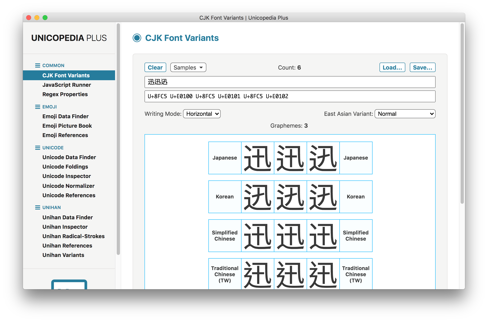

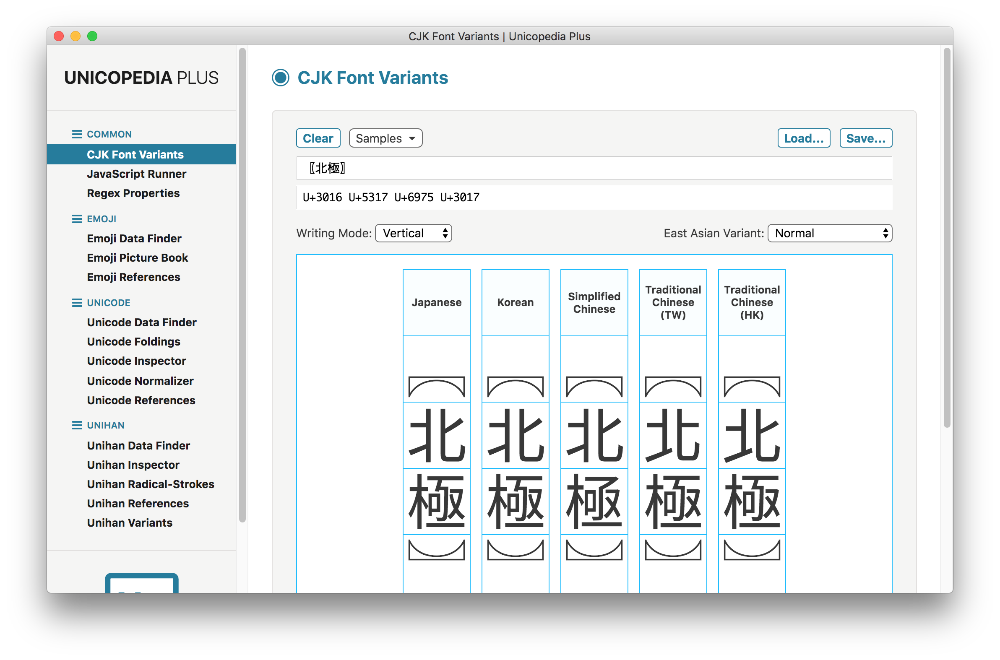

## JavaScript Runner

- The **JavaScript Runner** utility lets you execute JavaScript code, and comes with several sample scripts related to Unicode, Unihan, and emoji; it is useful for quick testing/prototyping or data processing.

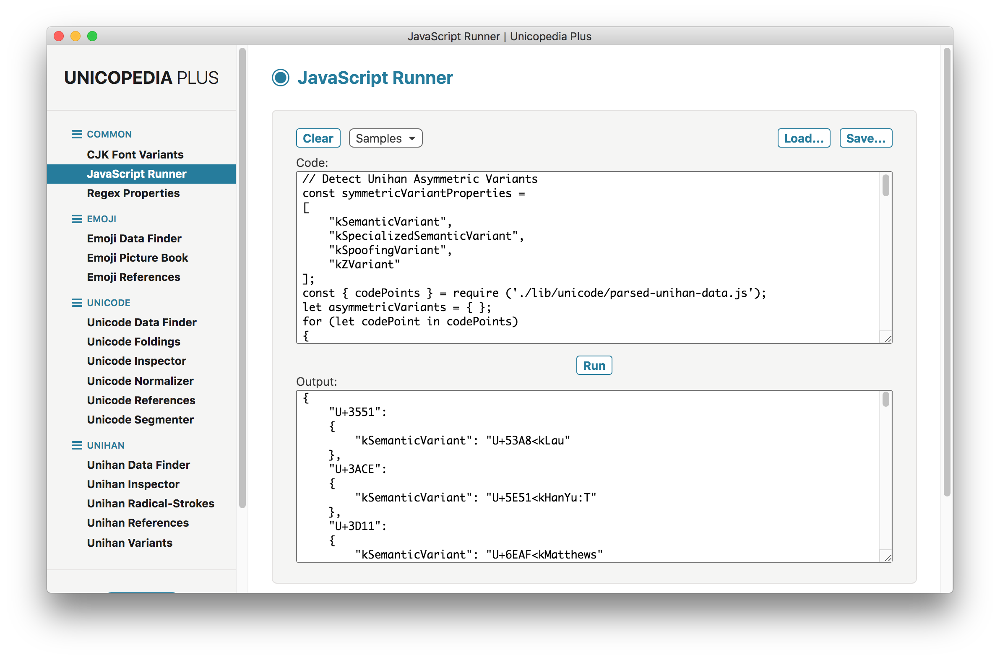

## Regex Properties

- The **Regex Properties** utility displays all the **Unicode 13.0** properties available for regular expressions, used in particular by the **Emoji Data Finder**, **Unicode Data Finder** and **Unihan Data Finder** utilities.
- These properties are suitable to build Unicode-aware regular expressions in JavaScript (ECMAScript 6) using the 'u' flag.
- Unicode properties fall into four groups, which can be displayed individually using the <kbd>Category</kbd> drop-down menu:
    - **General Category** properties
    - **Binary** properties
    - **Script** properties
    - **Script Extensions** properties
- For **General Category** properties, prefixing with `General_Category=` (Canonical) or `gc=` (Alias) is optional. Use the <kbd>Optional Prefix</kbd> checkbox to control whether the prefix is included or not.
- Groupings:

    | Property | Description |
    | -------- | ----------- |
    | Cased_Letter | Uppercase_Letter \| Lowercase_Letter \| Titlecase_Letter |
    | Letter | Uppercase_Letter \| Lowercase_Letter \| Titlecase_Letter \| Modifier_Letter \| Other_Letter |
    | Mark | Nonspacing_Mark \| Spacing_Mark \| Enclosing_Mark |
    | Number | Decimal_Number \| Letter_Number \| Other_Number |
    | Punctuation | Connector_Punctuation \| Dash_Punctuation \| Open_Punctuation \| Close_Punctuation \| Initial_Punctuation \| Final_Punctuation \| Other_Punctuation |
    | Symbol | Math_Symbol \| Currency_Symbol \| Modifier_Symbol \| Other_Symbol |
    | Separator | Space_Separator \| Line_Separator \| Paragraph_Separator |
    | Other | Control \| Format \| Surrogate \| Private_Use \| Unassigned |

- `\P{…}` is the negated form of `\p{…}`. Use the <kbd>Negated</kbd> checkbox to toggle between the two forms.
- Notes:
    - `\p{Any}` is equivalent to `[\u{0}-\u{10FFFF}]`
    - `\p{ASCII}` is equivalent to `[\u{0}-\u{7F}]`
    - `\p{Assigned}` is equivalent to `\P{Unassigned}` or `\P{General_Category=Unassigned}`

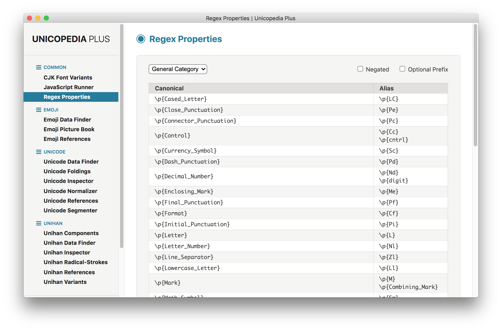

## Emoji Data Finder

### Find by Name

- The **Find by Name** feature of the **Emoji Data Finder** utility displays a list of basic data (emoji, short name, keywords, code points) of matching Unicode emoji searched by name or keyword, including through regular expressions.
- After entering a query, click on the <kbd>Search</kbd> button to display a list of all relevant matches, if any.
- This feature deals with the 4,590 emoji defined in the **Emoji 13.1** version of the [emoji-test.txt](https://www.unicode.org/Public/emoji/13.1/emoji-test.txt) data file.
- The 9 *component* (5 *skin-tone* and 4 *hair-style*) emoji and the 3,512 *fully-qualified* (**RGI**) emoji are presented in a standard way, while the 1,069 *non-fully-qualified* emoji are shown in a distinctive muted (grayed out) style.
- Use the <kbd>Results&nbsp;▾</kbd> pop-up menu to perform an action among:
    - `Copy Results` [copy the results as string to the clipboard]
    - `Save Results...` [save the results as string to a text file]
    - `Clear Results` [clear the current list of results]
- Various examples of regular expressions are provided for quick copy-and-paste.
- Note: **RGI** stands for *Recommended for General Interchange*.

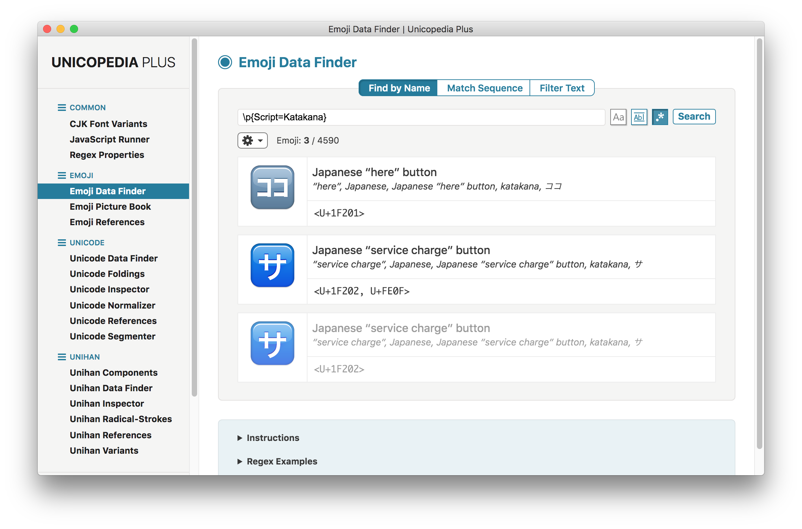

### Match Sequence

- The **Match Sequence** feature of the **Emoji Data Finder** utility displays a list of basic data (emoji, short name, keywords, code points) of Unicode emoji matching a character sequence, including through regular expressions.
- After entering a query, click on the <kbd>Search</kbd> button to display a list of all relevant matches, if any.
- This feature deals with the 4,590 emoji defined in the **Emoji 13.1** version of the [emoji-test.txt](https://www.unicode.org/Public/emoji/13.1/emoji-test.txt) data file.
- The 9 *component* (5 *skin-tone* and 4 *hair-style*) emoji and the 3,512 *fully-qualified* (**RGI**) emoji are presented in a standard way, while the 1,069 *non-fully-qualified* emoji are shown in a distinctive muted (grayed out) style.
- Use the <kbd>Results&nbsp;▾</kbd> pop-up menu to perform an action among:
    - `Copy Results` [copy the results as string to the clipboard]
    - `Save Results...` [save the results as string to a text file]
    - `Clear Results` [clear the current list of results]
- Various examples of regular expressions are provided for quick copy-and-paste.
- Note: **RGI** stands for *Recommended for General Interchange*.

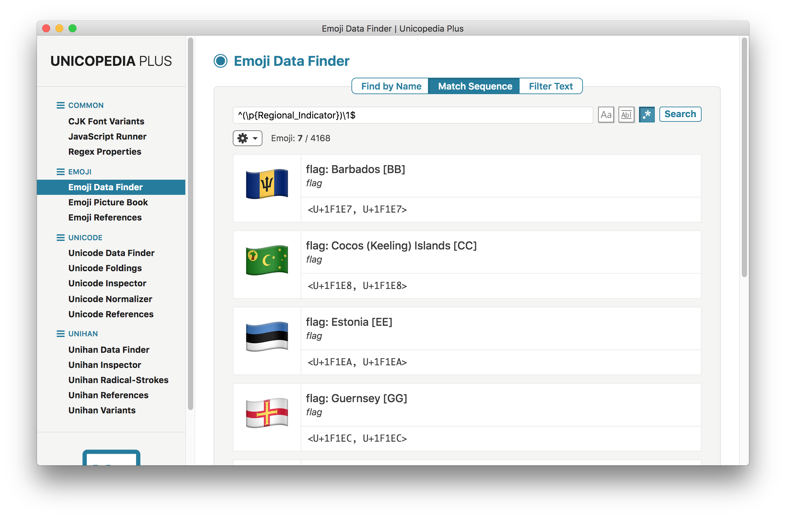

### Filter Text

- The **Filter Text** feature of the **Emoji Data Finder** utility displays in real time a list of basic data (emoji, short name, keywords, code points) of all the Unicode emoji contained in a text string.
- Text can by directly typed, or pasted from the clipboard into the main input field.
- It is also possible to input predefined sets of emoji selected from the <kbd>Samples&nbsp;▾</kbd> pop-up menu.
- As a convenience, the input field can be emptied using the <kbd>Clear</kbd> button.
- Use the <kbd>Filter&nbsp;▾</kbd> pop-up menu to perform an action among:
    - `Discard Non-Emoji` [strip out non-emoji characters]
    - `Upgrade to RGI Emoji` [restore incomplete emoji to their **RGI** form]
    - `Remove Duplicate Emoji` [delete emoji duplicates]
- This feature deals with the 4,590 emoji defined in the **Emoji 13.1** version of the [emoji-test.txt](https://www.unicode.org/Public/emoji/13.1/emoji-test.txt) data file.
- The 9 *component* (5 *skin-tone* and 4 *hair-style*) emoji and the 3,512 *fully-qualified* (**RGI**) emoji are presented in a standard way, while the 1,069 *non-fully-qualified* emoji are shown in a distinctive muted (grayed out) style.
- Use the <kbd>Results&nbsp;▾</kbd> pop-up menu to perform an action among:
    - `Copy Results` [copy the results as string to the clipboard]
    - `Save Results...` [save the results as string to a text file]
- Note: **RGI** stands for *Recommended for General Interchange*.

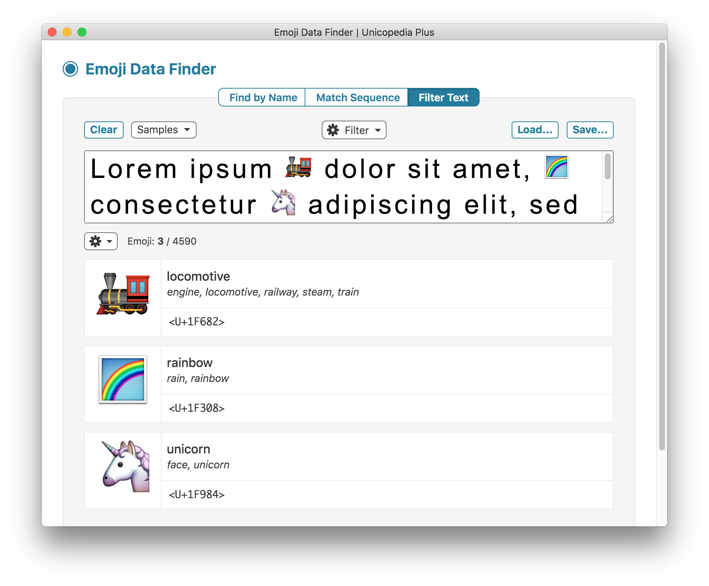

## Emoji Picture Book

- The **Emoji Picture Book** utility displays lists of Unicode emoji in a color picture book fashion.
- Any group of pictures can be displayed by selecting its name in the <kbd>Category</kbd> drop-down menu, among:
    - **Smileys & Emotion**
    - **People & Body**
    - **Component**
    - **Animals & Nature**
    - **Food & Drink**
    - **Travel & Places**
    - **Activities**
    - **Objects**
    - **Symbols**
    - **Flags**
- The size of all emoji pictures (from 32 to 128&nbsp;pixels) can be adjusted by moving the dedicated slider left and right.
- The groups and subgroups of emoji are those defined in the **Emoji 13.1** version of the [emoji-test.txt](https://www.unicode.org/Public/emoji/13.1/emoji-test.txt) data file.
- Only the 9 *component* emoji and the 3,512 *fully-qualified* (**RGI**) forms of the emoji are used unless they cannot be displayed properly, depending on the emoji support level of the operating system.
- Emoji failing to be represented as proper color pictures are purely and simply discarded.
- Note: **RGI** stands for *Recommended for General Interchange*.

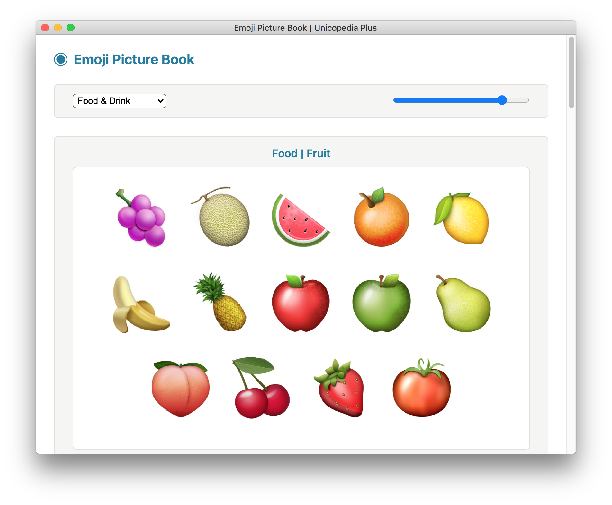

## Emoji References

- The **Emoji References** utility provides a list of reference links to emoji-related web pages.

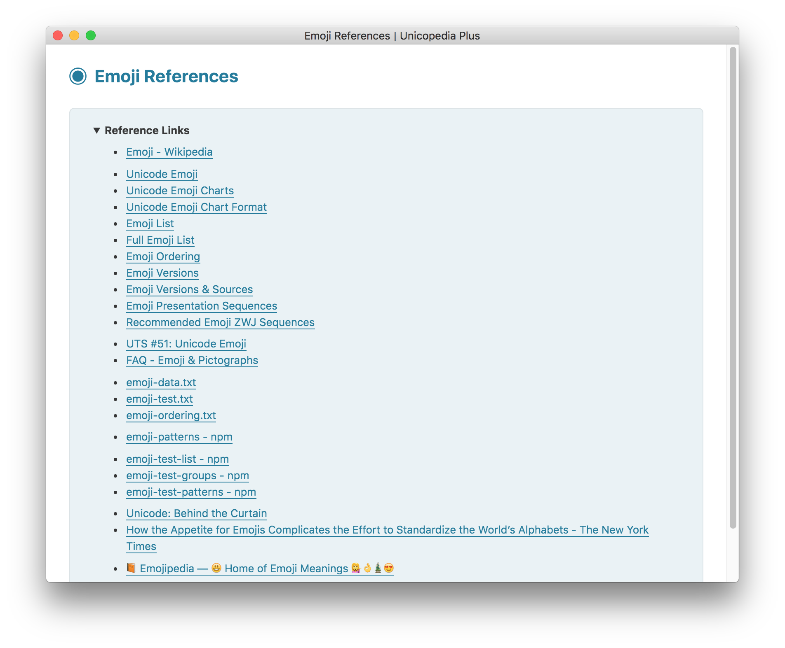

## Unicode Data Finder

### Find by Name

- The **Find by Name** feature of the **Unicode Data Finder** utility displays a list of basic data (character, code point, name/aliases, block) of matching Unicode characters searched by name or alias, including through regular expressions.
- After entering a query, click on the <kbd>Search</kbd> button to display a list of all relevant matches, if any, ordered by code point value.
- It is possible to choose how many characters are shown one page at a time.
- When available, name aliases are displayed (in italics and smaller typeface) after the unique and immutable Unicode name. A correction alias is indicated by a leading reference mark `※`.
- All names and aliases are obtained from the [UnicodeData.txt](https://www.unicode.org/Public/UNIDATA/UnicodeData.txt) and [NameAliases.txt](https://www.unicode.org/Public/UNIDATA/NameAliases.txt) data files.
- The search is performed on the 283,440 assigned characters (or code points) defined in the **Unicode 13.0** version of the [UnicodeData.txt](https://www.unicode.org/Public/UNIDATA/UnicodeData.txt) data file.
- Use the <kbd>Results&nbsp;▾</kbd> pop-up menu to perform an action among:
    - `Copy Results` [copy the results as string to the clipboard]
    - `Save Results...` [save the results as string to a text file]
    - `Clear Results` [clear the current list of results]
- Various examples of regular expressions are provided for quick copy-and-paste.

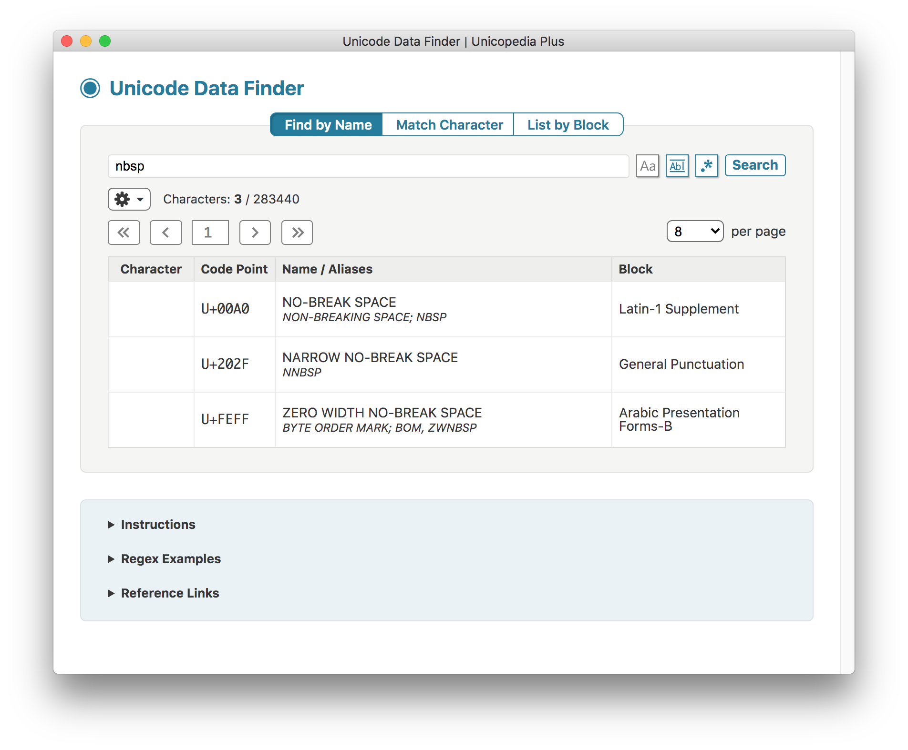

### Match Character

- The **Match Character** feature of the **Unicode Data Finder** utility displays a list of basic data (character, code point, name/aliases, block) of Unicode characters matching a character, including through regular expressions.
- After entering a query, click on the <kbd>Search</kbd> button to display a list of all relevant matches, if any, ordered by code point value.
- Click on the <kbd>Match Decomposition</kbd> toggle button to extend the search to characters whose *decomposition mapping* matches the query string.
- It is possible to choose how many characters are shown one page at a time.
- The search is performed on the 283,440 assigned characters (or code points) defined in the **Unicode 13.0** version of the [UnicodeData.txt](https://www.unicode.org/Public/UNIDATA/UnicodeData.txt) data file.
- Use the <kbd>Results&nbsp;▾</kbd> pop-up menu to perform an action among:
    - `Copy Results` [copy the results as string to the clipboard]
    - `Save Results...` [save the results as string to a text file]
    - `Clear Results` [clear the current list of results]
- Various examples of regular expressions are provided for quick copy-and-paste.

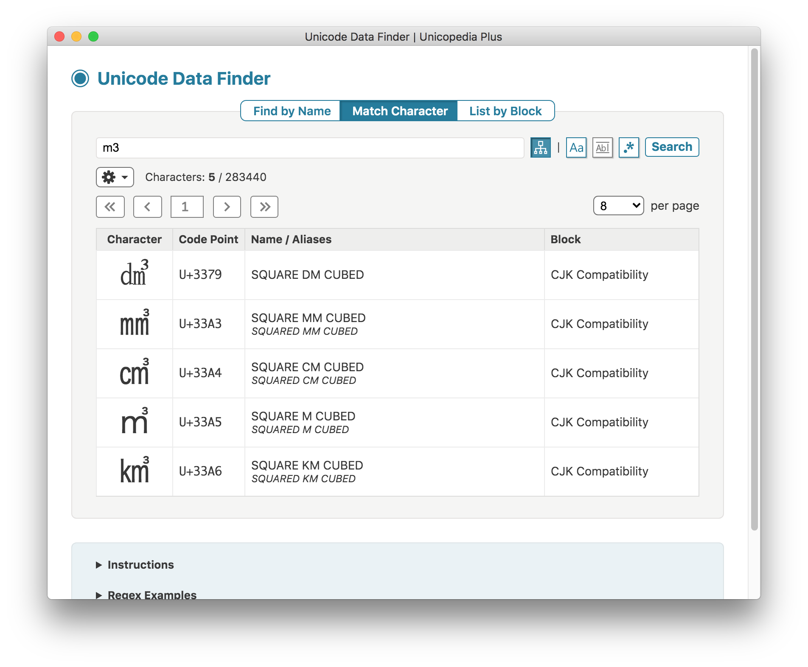

### List by Block

- The **List by Block** feature of the **Unicode Data Finder** utility displays in real time a list of basic data (character, code point, name/aliases, block) of Unicode characters belonging to the same block range.
- It is possible to choose how many characters are shown one page at a time.
- A block can be selected either by <kbd>Block Name</kbd> or by <kbd>Block Range</kbd>, as defined in the [Blocks.txt](https://www.unicode.org/Public/UNIDATA/Blocks.txt) data file.
- It is also possible to directly enter a code point (or character) in the <kbd>Specimen</kbd> field, then click on the <kbd>Go</kbd> button to automatically select the block containing the code point, scroll its basic data into view, and highlight its hexadecimal code value.
- You can quickly reuse a previously entered code point by using the <kbd>Alt</kbd>+<kbd>↑</kbd> and <kbd>Alt</kbd>+<kbd>↓</kbd> keyboard shortcuts to navigate up and down through the history stack in the <kbd>Specimen</kbd> field. Alternatively, you can also use the <kbd>Specimen&nbsp;History&nbsp;▾</kbd> pop-up menu to automatically jump to a specific character.
- Use the <kbd>Results&nbsp;▾</kbd> pop-up menu to perform an action among:
    - `Copy Results` [copy the results as string to the clipboard]
    - `Save Results...` [save the results as string to a text file]

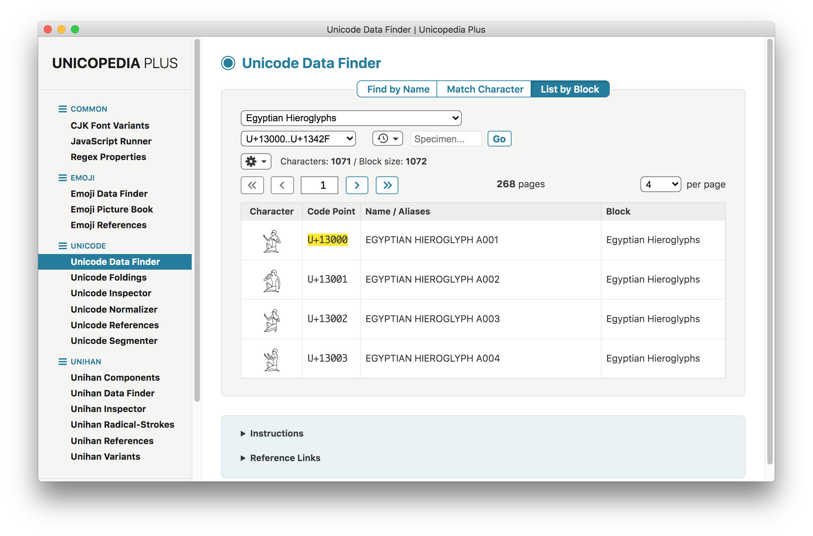

## Unicode Foldings

- The **Unicode Foldings** utility displays simultaneously the uppercase and lowercase foldings of a given string, making use of the JavaScript string functions [toUpperCase](https://developer.mozilla.org/en-US/docs/Web/JavaScript/Reference/Global_Objects/String/toUpperCase) and [toLowerCase](https://developer.mozilla.org/en-US/docs/Web/JavaScript/Reference/Global_Objects/String/toLowerCase), or [toLocaleUpperCase](https://developer.mozilla.org/en-US/docs/Web/JavaScript/Reference/Global_Objects/String/toLocaleUpperCase) and [toLocaleLowerCase](https://developer.mozilla.org/en-US/docs/Web/JavaScript/Reference/Global_Objects/String/toLocaleLowerCase) when a specific locale is selected from the <kbd>Locale</kbd> drop-down menu.
- Characters can be entered either directly in the "Characters" input field, or using a series of code points in hexadecimal format in the "Code points" input field.
- It is also possible to input predefined strings of characters selected from the <kbd>Samples&nbsp;▾</kbd> pop-up menu.
- As a convenience, the input fields can be emptied using the <kbd>Clear</kbd> button.
- In output, the standard Unicode code point format `U+00DF` is used, i.e. "U+" directly followed by 4 or 5 hex digits.
- In input, more hexadecimal formats are allowed, including Unicode escape sequences, such as `\u212B` or `\u{10400}`. Moving out of the field or typing the Enter key converts all valid codes to standard Unicode code point format.
- Note: *folding* is an operation that maps similar characters to a common target, such as uppercasing or lowercasing a string. Folding operations are most often used to temporarily ignore certain distinctions between characters.

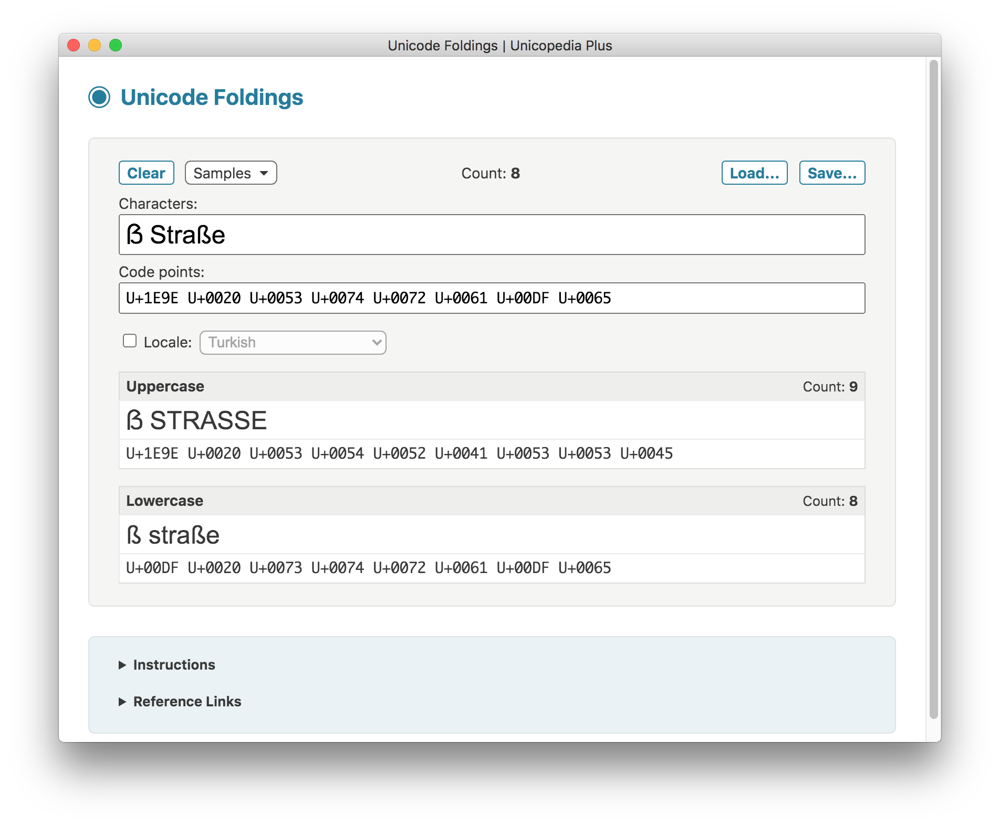

## Unicode Inspector

- The **Unicode Inspector** utility displays code point information in real time for each Unicode character of a text string.
- Characters can be entered either directly in the "Characters" input field, or using a series of code points in hexadecimal format in the "Code points" input field.
- It is also possible to input predefined sets of characters selected from the <kbd>Samples&nbsp;▾</kbd> pop-up menu.
- As a convenience, the input fields can be emptied using the <kbd>Clear</kbd> button.
- In output, the standard Unicode code point format `U+0041` is used, i.e. "U+" directly followed by 4 or 5 hex digits.
- In input, more hexadecimal formats are allowed, including Unicode escape sequences, such as `\u611B` or `\u{1F49C}`. Moving out of the field or typing the Enter key converts all valid codes to standard Unicode code point format.
- Information is provided for the 283,440 assigned characters (or code points) defined in the **Unicode 13.0** version of the [UnicodeData.txt](https://www.unicode.org/Public/UNIDATA/UnicodeData.txt) data file.
- Extra information is also obtained from the following data files:
    - [ArabicShaping.txt](https://www.unicode.org/Public/UNIDATA/ArabicShaping.txt)
    - [Blocks.txt](https://www.unicode.org/Public/UNIDATA/Blocks.txt)
    - [CaseFolding.txt](https://www.unicode.org/Public/UNIDATA/CaseFolding.txt)
    - [DerivedAge.txt](https://www.unicode.org/Public/UNIDATA/DerivedAge.txt)
    - [DerivedCoreProperties.txt](https://www.unicode.org/Public/UNIDATA/DerivedCoreProperties.txt)
    - [EastAsianWidth.txt](https://www.unicode.org/Public/UNIDATA/EastAsianWidth.txt)
    - [EquivalentUnifiedIdeograph.txt](https://www.unicode.org/Public/UNIDATA/EquivalentUnifiedIdeograph.txt)
    - [IndicPositionalCategory.txt](https://www.unicode.org/Public/UNIDATA/IndicPositionalCategory.txt)
    - [IndicSyllabicCategory.txt](https://www.unicode.org/Public/UNIDATA/IndicSyllabicCategory.txt)
    - [LineBreak.txt](https://www.unicode.org/Public/UNIDATA/LineBreak.txt)
    - [NameAliases.txt](https://www.unicode.org/Public/UNIDATA/NameAliases.txt)
    - [PropList.txt](https://www.unicode.org/Public/UNIDATA/PropList.txt)
    - [Scripts.txt](https://www.unicode.org/Public/UNIDATA/Scripts.txt)
    - [ScriptExtensions.txt](https://www.unicode.org/Public/UNIDATA/ScriptExtensions.txt)
    - [StandardizedVariants.txt](https://www.unicode.org/Public/UNIDATA/StandardizedVariants.txt)
    - [VerticalOrientation.txt](https://www.unicode.org/Public/UNIDATA/VerticalOrientation.txt)
    - [emoji-data.txt](https://www.unicode.org/Public/13.0.0/ucd/emoji/emoji-data.txt)

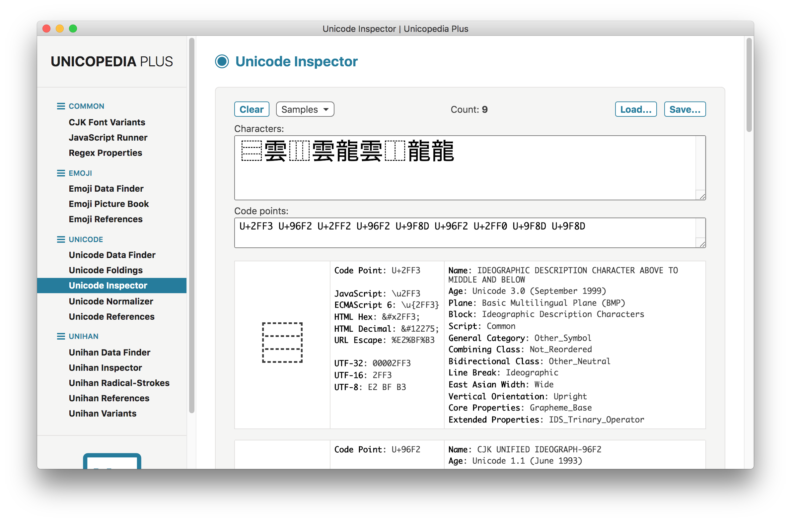

## Unicode Normalizer

- The **Unicode Normalizer** utility displays simultaneously the four normalization forms of a given string, making use of the JavaScript string function [normalize](https://developer.mozilla.org/en-US/docs/Web/JavaScript/Reference/Global_Objects/String/normalize), as specified in the [UAX #15: Unicode Normalization Forms](https://www.unicode.org/reports/tr15/):

    | Form | Name | Description |
    | ---- | ---- | ----------- |
    | NFC | Normalization Form C | Canonical Decomposition, followed by Canonical Composition |
    | NFD | Normalization Form D | Canonical Decomposition |
    | NFKC | Normalization Form KC | Compatibility Decomposition, followed by Canonical Composition |
    | NFKD | Normalization Form KD | Compatibility Decomposition |

- Characters can be entered either directly in the "Characters" input field, or using a series of code points in hexadecimal format in the "Code points" input field.
- It is also possible to input predefined strings of characters selected from the <kbd>Samples&nbsp;▾</kbd> pop-up menu.
- As a convenience, the input fields can be emptied using the <kbd>Clear</kbd> button.
- In output, the standard Unicode code point format `U+212B` is used, i.e. "U+" directly followed by 4 or 5 hex digits.
- In input, more hexadecimal formats are allowed, including Unicode escape sequences, such as `\u24B6` or `\u{1F201}`. Moving out of the field or typing the Enter key converts all valid codes to standard Unicode code point format.

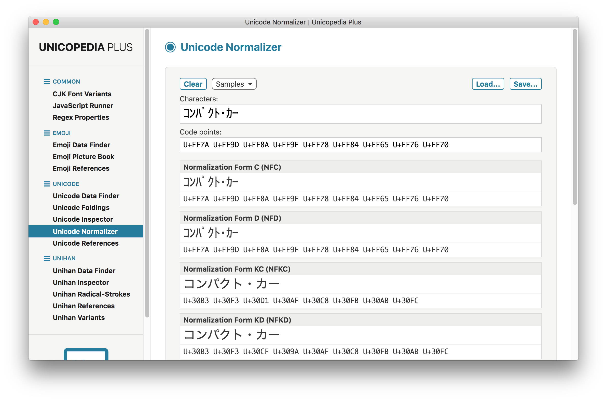

## Unicode References

- The **Unicode References** utility provides a list of reference links to Unicode-related web pages.

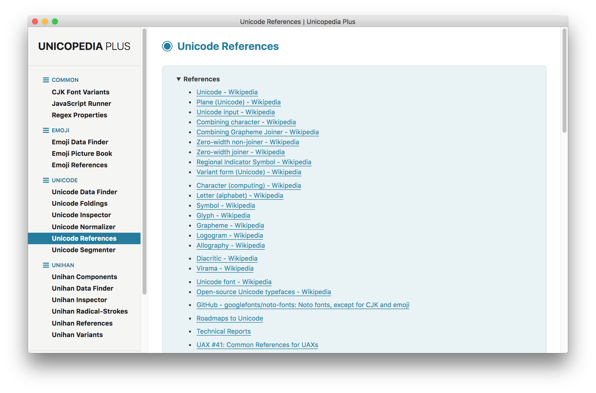

## Unicode Segmenter

- The **Unicode Segmenter** utility performs in real time the segmentation of a text string into a visual list of graphemes, words, or sentences, making use of the JavaScript [Intl.Segmenter](https://developer.mozilla.org/en-US/docs/Web/JavaScript/Reference/Global_Objects/Intl/Segmenter) API, as specified in the [UAX #29: Unicode Text Segmentation](https://www.unicode.org/reports/tr29/).
- Text can by directly typed, or pasted from the clipboard into the main input field.
- It is also possible to input predefined text strings selected from the <kbd>Samples&nbsp;▾</kbd> pop-up menu.
- As a convenience, the input field can be emptied using the <kbd>Clear</kbd> button.
- Choose the appropriate segmentation granularity from the <kbd>Granularity</kbd> drop-down menu, among: `Grapheme`, `Word`, or `Sentence`.
- If required, choose a specific locale from the <kbd>Locale</kbd> drop-down menu: boundary types are actually locale-dependent.

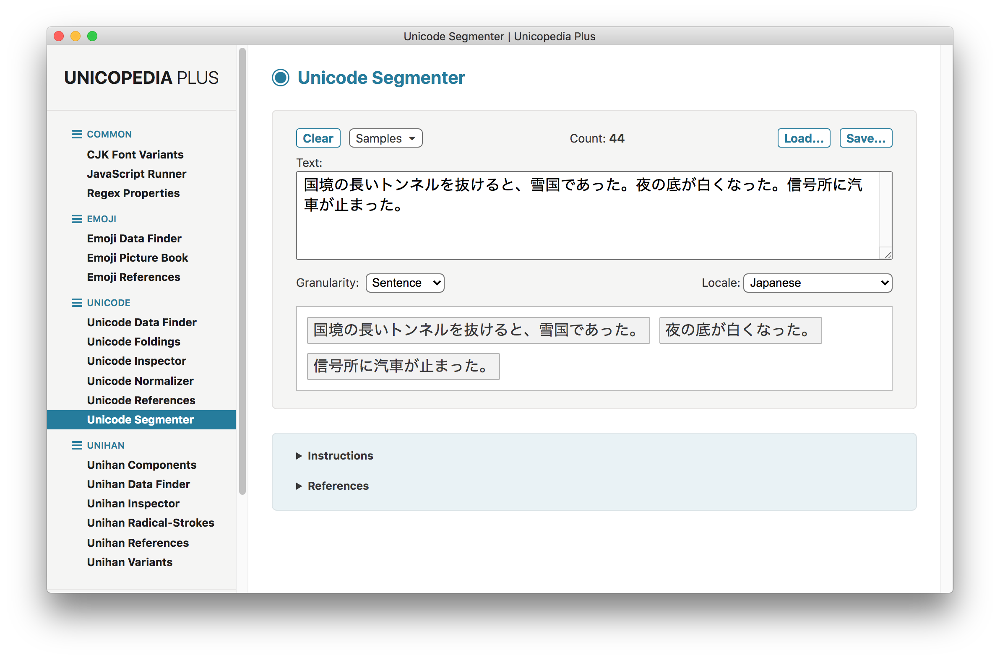

## Unihan Data Finder

### Find by Tag Value

- The **Find by Tag Value** feature of the **Unihan Data Finder** utility displays a list of basic data (character, code point, Unihan tag, value, block) of matching Unihan characters searched by tag value, including through regular expressions.
- Use the <kbd>Unihan Tag</kbd> drop-down menu to select the tag you wish to search value by.
- Use the <kbd>Categories</kbd> checkbox to toggle between: all Unihan tags ordered alphabetically, or grouped by categories in the drop-down menu.
- After entering a query, click on the <kbd>Search</kbd> button to display a list of all relevant matches, if any, ordered by code point value.
- It is possible to choose how many characters are shown one page at a time.
- The search is performed on the 93,858 Unihan characters (or code points) defined in the set of data files contained in the [Unihan.zip](https://www.unicode.org/Public/UNIDATA/Unihan.zip) archive file:
    - *Unihan_DictionaryIndices.txt*
    - *Unihan_DictionaryLikeData.txt*
    - *Unihan_IRGSources.txt*
    - *Unihan_NumericValues.txt*
    - *Unihan_OtherMappings.txt*
    - *Unihan_RadicalStrokeCounts.txt*
    - *Unihan_Readings.txt*
    - *Unihan_Variants.txt*
- Use the <kbd>Results&nbsp;▾</kbd> pop-up menu to perform an action among:
    - `Copy Results` [copy the results as string to the clipboard]
    - `Save Results...` [save the results as string to a text file]
    - `Clear Results` [clear the current list of results]
- Various examples of regular expressions are provided for quick copy-and-paste.

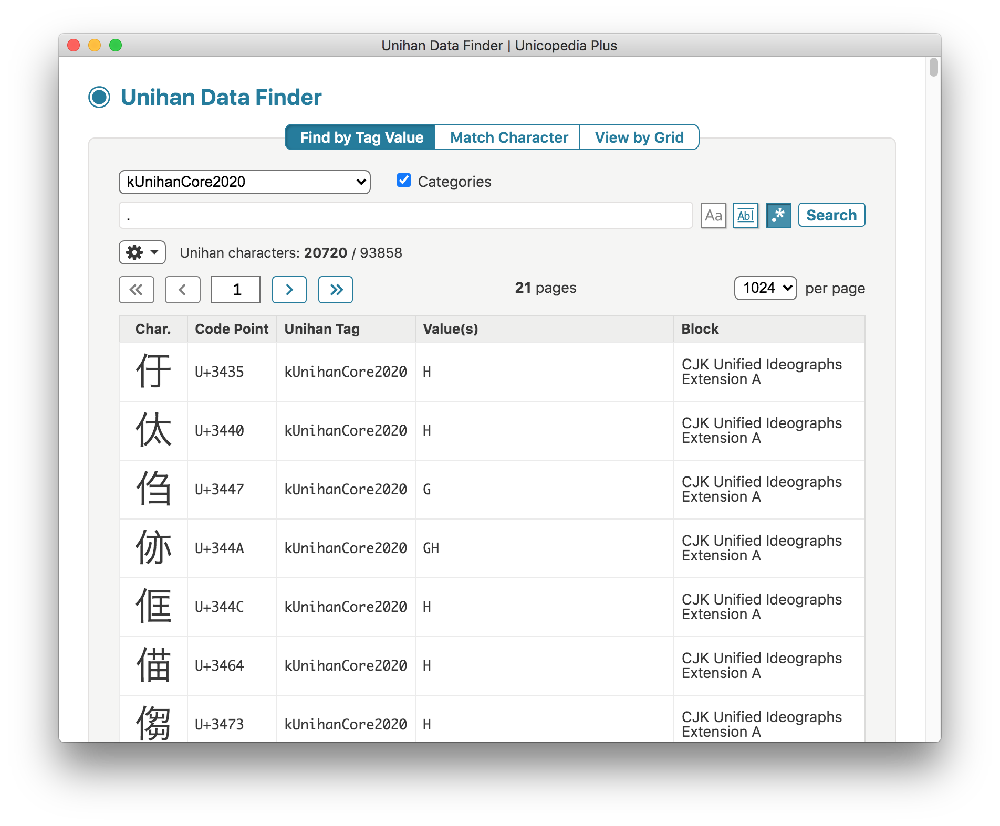

### Match Character

- The **Match Character** feature of the **Unihan Data Finder** utility displays a list of basic data (character, code point, age, set, ideograph status, block) of matching Unihan characters, including through regular expressions.
- After entering a query, click on the <kbd>Search</kbd> button to display a list of all relevant matches, if any, ordered by code point value.
- Click on the <kbd>Match Variants</kbd> toggle button to extend the search to characters whose *variants* match the query string.
- Unihan variants, if any, are displayed in a distinctive muted (grayed out) style.
- It is possible to choose how many characters are shown one page at a time.
- The search is performed on the set of 93,858 Unihan characters defined in **Unicode 13.0**.
- Use the <kbd>Results&nbsp;▾</kbd> pop-up menu to perform an action among:
    - `Copy Results` [copy the results as string to the clipboard]
    - `Save Results...` [save the results as string to a text file]
    - `Clear Results` [clear the current list of results]
- Various examples of regular expressions are provided for quick copy-and-paste.

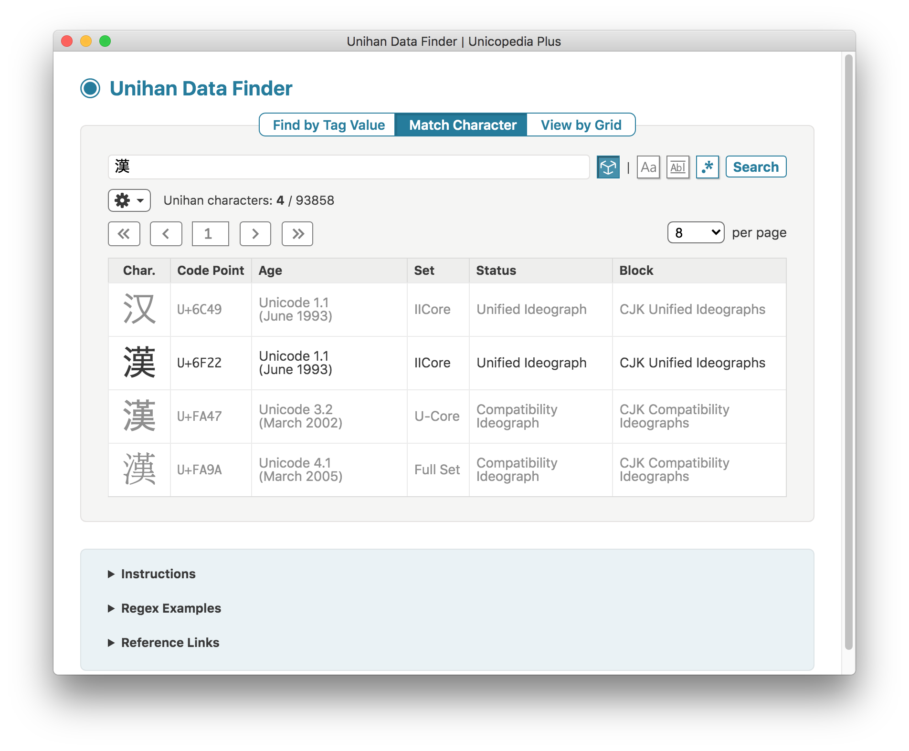

### View by Grid

- The **View by Grid** feature of the **Unihan Data Finder** utility displays in real time a grid view of the 10 blocks containing the 93,858 Unihan characters defined in **Unicode 13.0**.
- It is possible to choose how many characters are shown one page at a time.
- A block can be selected either by <kbd>Block Name</kbd> or by <kbd>Block Range</kbd>.
- It is also possible to directly enter a Unihan character or code point in the <kbd>Specimen</kbd> field, then click on the <kbd>Go</kbd> button to automatically select the block containing the character, scroll it into view, and highlight it.
- You can quickly reuse a previously entered Unihan character by using the <kbd>Alt</kbd>+<kbd>↑</kbd> and <kbd>Alt</kbd>+<kbd>↓</kbd> keyboard shortcuts to navigate up and down through the history stack in the <kbd>Specimen</kbd> field. Alternatively, you can also use the <kbd>Specimen&nbsp;History&nbsp;▾</kbd> pop-up menu to automatically jump to a specific character.
- Use the <kbd>Results&nbsp;▾</kbd> pop-up menu to perform an action among:
    - `Copy Results` [copy the results as string to the clipboard]
    - `Save Results...` [save the results as string to a text file]
- A list of all the Unihan blocks is available for quick reference.

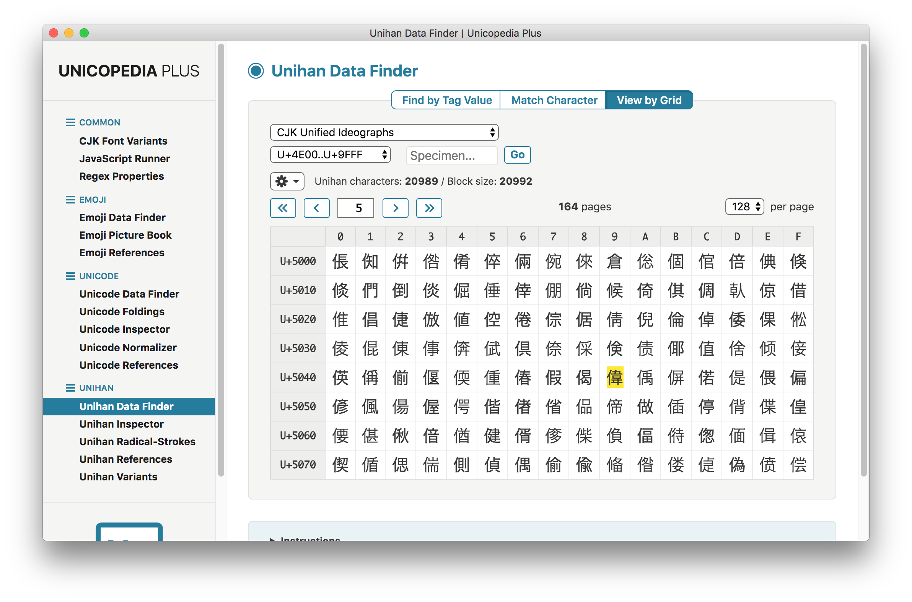

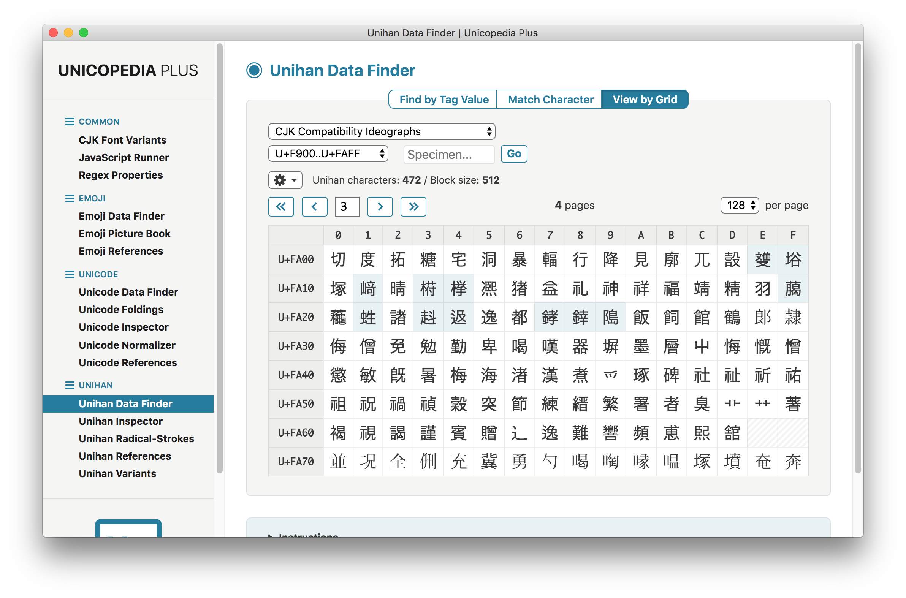

## Unihan Inspector

- The **Unihan Inspector** utility displays all available Unihan tags for each of the 93,858 Unihan characters defined in the set of data files contained in the [Unihan.zip](https://www.unicode.org/Public/UNIDATA/Unihan.zip) archive file:
    - *Unihan_DictionaryIndices.txt*
    - *Unihan_DictionaryLikeData.txt*
    - *Unihan_IRGSources.txt*
    - *Unihan_NumericValues.txt*
    - *Unihan_OtherMappings.txt*
    - *Unihan_RadicalStrokeCounts.txt*
    - *Unihan_Readings.txt*
    - *Unihan_Variants.txt*
- Any Unihan character can be entered in the <kbd>Unihan</kbd> input field either as a character or a code point. Click on the <kbd>Look Up</kbd> button to display the list of Unihan tags.
- In addition, the utility provides, for each Unihan character:
    - basic Unicode information: name, age, plane, block, script, script extensions, general category, extended properties, decomposition, standardized variation, equivalent unified ideograph;
    - basic Unihan information: set (*IICore*, *Unihan Core*, *Full Unihan*), status (*unified* or *compatibility* ideograph), compatibility source, radical/strokes, definition, numeric value, related characters, variant characters.
- Basic radical information can also be obtained for the 214 KangXi radicals and the 115 additional CJK radicals.
- Previously looked up characters are kept in a history stack; use the <kbd>Alt</kbd>+<kbd>↑</kbd> and <kbd>Alt</kbd>+<kbd>↓</kbd> keyboard shortcuts to navigate through them up and down inside the input field. Alternatively, you can also use the <kbd>Lookup&nbsp;History&nbsp;▾</kbd> pop-up menu to automatically look up a specific character.
- It is also possible to look up a randomly selected Unihan character by clicking on the <kbd>Random</kbd> button; use the <kbd>Set</kbd> drop-down menu to perform the draw on a specified Unihan set:
    - `IICore`: the IICore set of 9,810 CJK unified ideographs in common usage,
    - `Unihan Core`: the Unihan core set (2020) of 20,720 CJK unified and compatibility ideographs, minimal set of required ideographs for East Asia,
    - `Full Unihan`: the full set of 93,858 Unihan characters.
- The currently looked up character is displayed at a large scale, followed by its code point.
- Click on <kbd>◀</kbd> or <kbd>▶</kbd> to step through five different CJK typefaces, among:
    - `JP`: Japanese
    - `KR`: Korean
    - `SC`: Simplified Chinese
    - `TC`: Traditional Chinese (Taiwan)
    - `HK`: Traditional Chinese (Hong Kong)
- If a character cannot be properly rendered in the five CJK typefaces, the system default typeface is automatically used instead.
- Use the <kbd>Categories</kbd> checkbox to toggle between: all Unihan tags ordered alphabetically, or grouped by categories.
- Variant characters, if any, are listed under several classes in the basic Unihan information panel:
    - `Unified Variant`: decomposition of the looked up character
    - `Compatibility Variants`: characters whose decomposition is the looked up character
    - `Semantic Variants`: characters listed under the *kSemanticVariant* Unihan tag
    - `Specialized Variants`: characters listed under the *kSpecializedSemanticVariant* Unihan tag
    - `Spoofing Variants`: characters listed under the *kSpoofingVariant* Unihan tag
    - `Shape (Z-) Variants` characters listed under the *kZVariant* Unihan tag
    - `Simplified Variants`: characters listed under the *kSimplifiedVariant* Unihan tag
    - `Traditional Variants`: characters listed under the *kTraditionalVariant* Unihan tag
    - `Shinjitai Variants`: Japanese simplified character variants (新字体)
    - `Kyūjitai Variants`: Japanese traditional character variants (旧字体)
    - `Yasuoka Variants`: characters drawn from the "Variants table for Unicode" data file <a title="http://kanji.zinbun.kyoto-u.ac.jp/~yasuoka/ftp/CJKtable/UniVariants.Z" href="http://kanji.zinbun.kyoto-u.ac.jp/~yasuoka/ftp/CJKtable/UniVariants.Z">UniVariants.txt</a> provided by Prof. <a title="http://kanji.zinbun.kyoto-u.ac.jp/~yasuoka/" href="http://kanji.zinbun.kyoto-u.ac.jp/~yasuoka/">Kōichi Yasuoka</a>
- Notes:
    - The top Radical/Strokes fields are displaying data obtained from the only informative IRG Source: *kRSUnicode*, while the bottom ones (in grayed-out style, if any) make use of the provisional sources: *kRSKangXi* and *kRSAdobe_Japan1_6*.
    - IICore (*International Ideographs Core*) represents a set of 9,810 important Unihan characters in everyday use throughout East Asia; it has been developed by the IRG.
    - IRG stands for *Ideographic Research Group*, formerly called *Ideographic Rapporteur Group*, a committee advising the Unicode Consortium about Asian language characters.
    - Radicals do *not* belong to the Unihan character set; they are allowed to be looked up here merely as a convenience, since they are closely related, and because their appearance is similar, or even identical, to their equivalent unified ideograph.

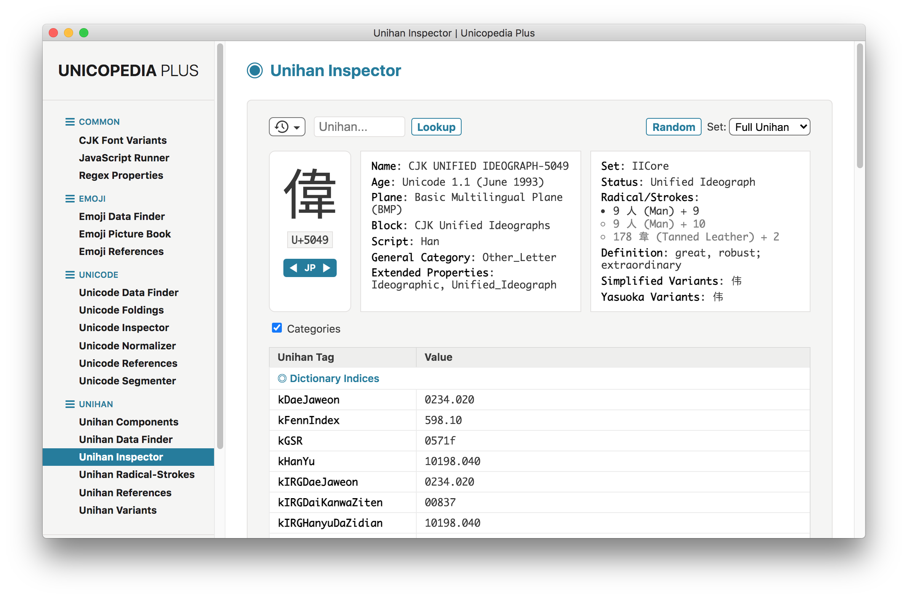

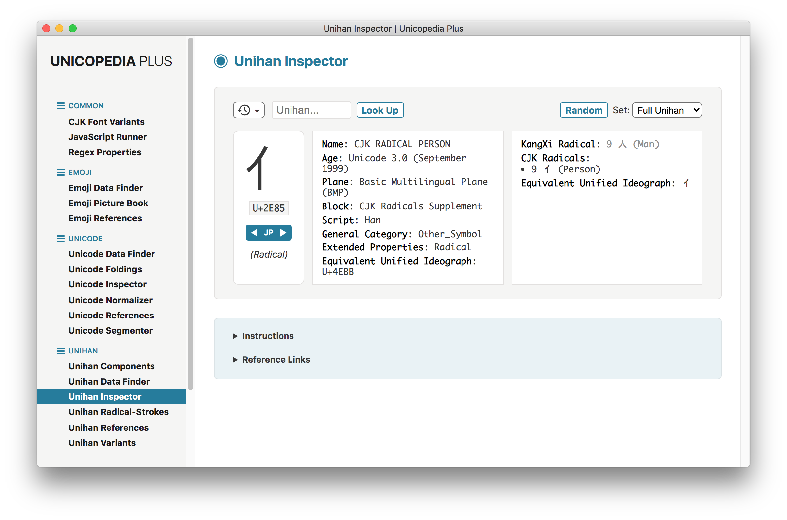

## Unihan Radical-Strokes

- The **Unihan Radical-Strokes** utility displays all the Unihan characters searched by KangXi radical and additional stroke count.
- Use the <kbd>Set</kbd> drop-down menu to perform the search on a specified Unihan set:
    - `IICore`: the IICore set of 9,810 CJK unified ideographs in common usage,
    - `Unihan Core`: the Unihan core set (2020) of 20,720 CJK unified and compatibility ideographs, minimal set of required ideographs for East Asia,
    - `Full Unihan`: the full set of 93,858 Unihan characters.
- Use the <kbd>Extra Sources</kbd> checkbox to extend the search to all radical/strokes source tags, or use only the IRG-defined source tag common to all Unihan characters.
- Use the <kbd>Radical</kbd> and <kbd>Strokes</kbd> drop-down menus to select the KangXi radical and the additional stroke count of the Unihan characters you are looking for, then click on the <kbd>Search</kbd> button.
- If the number of additional strokes is negative, 0 is used instead. For example, the Unihan character 王 gets listed under 'Radical 96 ⽟ (Jade)' + '0 Stroke', although its additional stroke count is -1.
- Selecting `All` from the <kbd>Strokes</kbd> menu lets you display all the Unihan characters sharing the same KangXi radical, sorted by additional stroke count.
- Use the <kbd>Results&nbsp;▾</kbd> pop-up menu to perform an action among:
    - `Copy Results` [copy the results as string to the clipboard]
    - `Save Results...` [save the results as string to a text file]
    - `Clear Results` [clear the current list of results]
- A complete list of the 214 KangXi radicals is available for reference, showing also CJK variants as well as simplified forms.

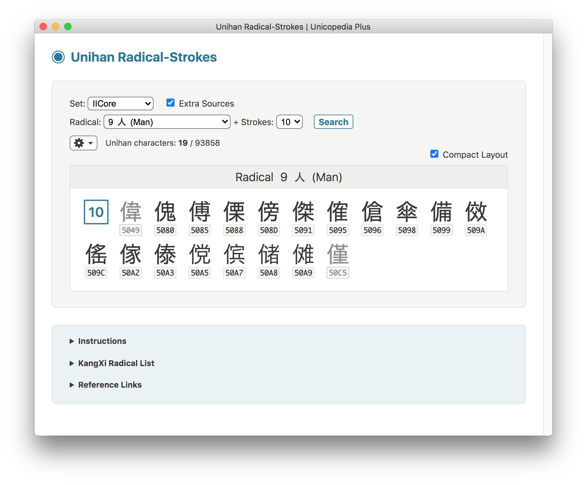

## Unihan References

- The **Unihan References** utility provides a list of reference links to Unihan-related web pages.

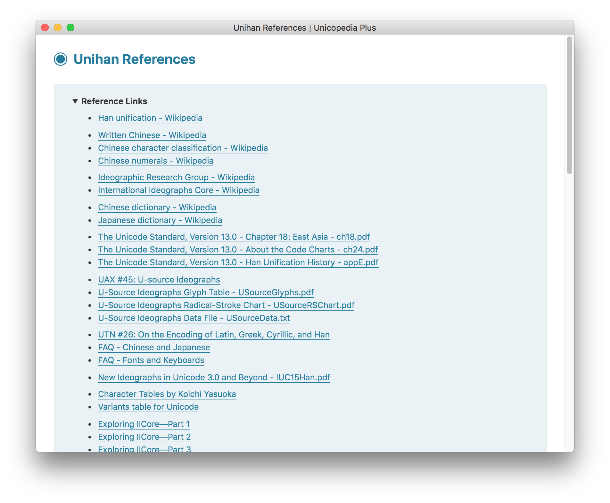

## Unihan Variants

- The **Unihan Variants** utility displays all the variants of a given Unihan character.
- Any Unihan character can be entered in the <kbd>Unihan</kbd> input field either as a character or a code point. Click on the <kbd>Look Up</kbd> button to display the variants.
- Previously looked up characters are kept in a history stack; use the <kbd>Alt</kbd>+<kbd>↑</kbd> and <kbd>Alt</kbd>+<kbd>↓</kbd> keyboard shortcuts to navigate through them up and down inside the input field. Alternatively, you can also use the <kbd>Lookup&nbsp;History&nbsp;▾</kbd> pop-up menu to automatically look up a specific character.
- Click the <kbd>Extra Variants</kbd> checkbox to include the Yasuoka variants as well; otherwise, only the standard Unihan variants are listed.
- Click the <kbd>Detailed Relations</kbd> checkbox to make use of a directed labeled graph to display variant relations; otherwise, a basic undirected graph is used instead.
- Click the <kbd>Code Points</kbd> checkbox to display as well the code point of each Unihan character of the graph.
- The different variant relations are indicated using the following labels:
    - `Compat.`: reverse link of `Unified`
    - `Kyūjitai`: Japanese traditional character variants (旧字体)
    - `Semantic`: characters listed under the *kSemanticVariant* Unihan tag
    - `Shape`: characters listed under the *kZVariant* Unihan tag
    - `Shinjitai`: Japanese simplified character variants (新字体)
    - `Simplified`: characters listed under the *kSimplifiedVariant* Unihan tag
    - `Specialized`: characters listed under the *kSpecializedSemanticVariant* Unihan tag
    - `Spoofing`: characters listed under the *kSpoofingVariant* Unihan tag
    - `Traditional`: characters listed under the *kTraditionalVariant* Unihan tag
    - `Unified`: characters listed under the *kCompatibilityVariant* Unihan tag
    - `Yasuoka`: characters drawn from the "Variants table for Unicode" data file <a title="http://kanji.zinbun.kyoto-u.ac.jp/~yasuoka/ftp/CJKtable/UniVariants.Z" href="http://kanji.zinbun.kyoto-u.ac.jp/~yasuoka/ftp/CJKtable/UniVariants.Z">UniVariants.txt</a> provided by Prof. <a title="http://kanji.zinbun.kyoto-u.ac.jp/~yasuoka/" href="http://kanji.zinbun.kyoto-u.ac.jp/~yasuoka/">Kōichi Yasuoka</a>
- Click the <kbd>Save...</kbd> button to save the current graph as a SVG file.
- Notes:
    - Hovering over any circled Unihan character of the graph displays a tooltip with basic information: code point, age, set, ideograph status, compatibility source.
    - The currently looked up Unihan character appears in a bolder circle; clicking on any other circled variant character lets you "navigate" through all the variants.
    - In order to avoid visual clutter, any relation between two Unihan characters obtained from the Yasuoka variants is not displayed if another "standard" one with the same orientation already exists.

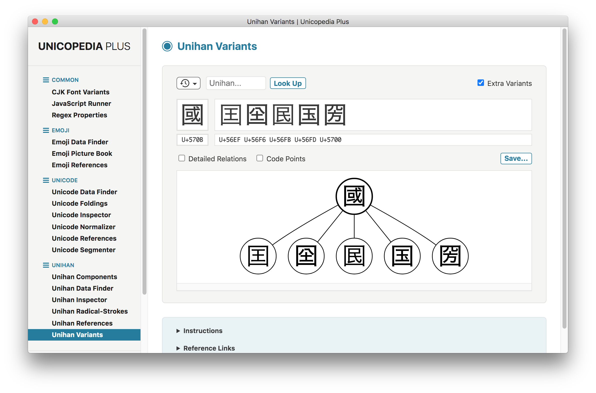

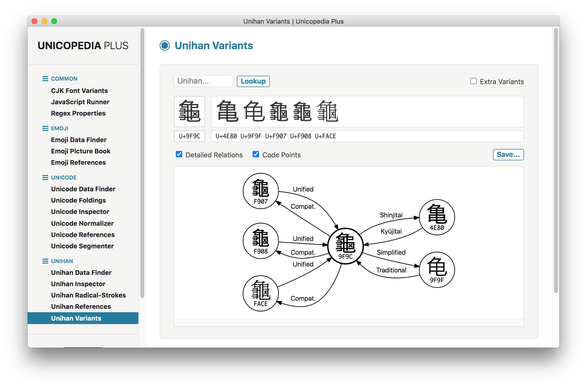

## Using

You can [download the latest release](https://github.com/tonton-pixel/unicopedia-plus/releases) for macOS.

## Building

You'll need [Node.js](https://nodejs.org/) (which comes with [npm](https://www.npmjs.com/)) installed on your computer in order to build this application.

### Clone method

```bash
# Clone the repository
git clone https://github.com/tonton-pixel/unicopedia-plus
# Go into the repository
cd unicopedia-plus
# Install dependencies
npm install
# Run the application
npm start
```

**Note**: to use the clone method, the core tool [git](https://www.git-scm.com/) must also be installed.

### Download method

If you don't wish to clone, you can [download the source code](https://github.com/tonton-pixel/unicopedia-plus/archive/master.zip), unZip it, then directly run the following commands from a Terminal opened at the resulting `unicopedia-plus-master` folder location:

```bash
# Install dependencies
npm install
# Run the application
npm start
```

### Packaging

Several scripts are also defined in the `package.json` file to build OS-specific bundles of the application, using the simple yet powerful [Electron Packager](https://github.com/electron-userland/electron-packager) Node module.\
For instance, running the following command (once the dependencies are installed) will create a `Unicopedia Plus.app` version for macOS:

```bash
# Build macOS (Darwin) application
npm run build-darwin
```

## License

The MIT License (MIT).

Copyright © 2018-2021 Michel Mariani.
